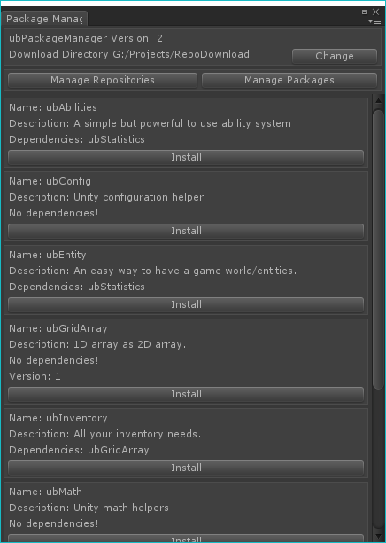

ubPackageManager
=

A **simple** package manager for use with Unity that uses git. The only external tool is git.

###  Quick Info

* Doesn't support ssh repo access
* Doesn't support lfs
* Uses git only and it must be accessible from PATH
* When selecting the download location for packages you cannot place it within your source for the project
* It creates a file `Config/PacmanConfig.json` that contains all the repository and package data for the project, best to commit this.
* It supports installing specific versions and uninstalling packages but it won't warn you if something installed depends on it
* It doesn't symlink anything, the files are directly copied

## Getting Started

1. Download from [*here*](https://github.com/nhold/ubPackageManager/releases)
2. Once installed in your project you can open the window from: `Bifrost->Package Manager`
3. Select a download directory by clicking the `Change` button, you can use the same directory across multiple projects if you like or a custom one per project. Select it outside of the source control of your current project
4. Add a repository by clicking on `Manage Repositories` button and then clicking `Add Repo`
5. Make sure to `Update` the repo to grab all packages

To create a repo just make a git repository and push up a group of package definition files.

Here is an example of a package definition file, the name of the file must match the name in the file:

```
{
    "name": "ubGridArray",
    "versions": [{
        "version": "1",
        "branch": "version-1"
    }],
    "description": "1D array as 2D array.",
    "location": "https://someurl/ubgridarray.git",
    "parentDir": "Bifrost",
    "childDir": "ubgridarray/Assets/Plugins/ubGridArray"
     "dependencies": [
        "ubConfig"
    ]
}
```

## Screenshots

